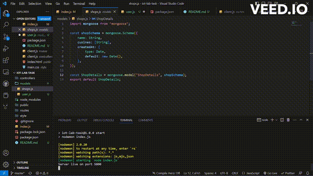

# Online Food Ordering App

## Table of contents

  - [Overview](#overview)
    - [The Task](#the-task)
    - [Screen recording of the app](#screen-recording-of-the-app)
  - [My Process](#my-process)
    - [Built With](#built-with)
  - [Author](#author)

## Overview

### The Task

Users should be able to :

- Create a data for a shop
- View the data on the homepage

### Screen Recording of the app

## My Process

### Built With

  - Node.js
  - Express.js
  - MongoDB
  - Mongoose
  - CSS
  - Bootstrap

## Author

- LinkedIn - [Gaurav Kumar Tripathi](https://www.linkedin.com/in/gaurav-kumar-tripathii/)
- Twitter - [Gaurav Tripathi](https://twitter.com/gaurav0tripathi)
- Frontend Mentor - [@Gauravtripathii](https://www.frontendmentor.io/profile/Gauravtripathii)
